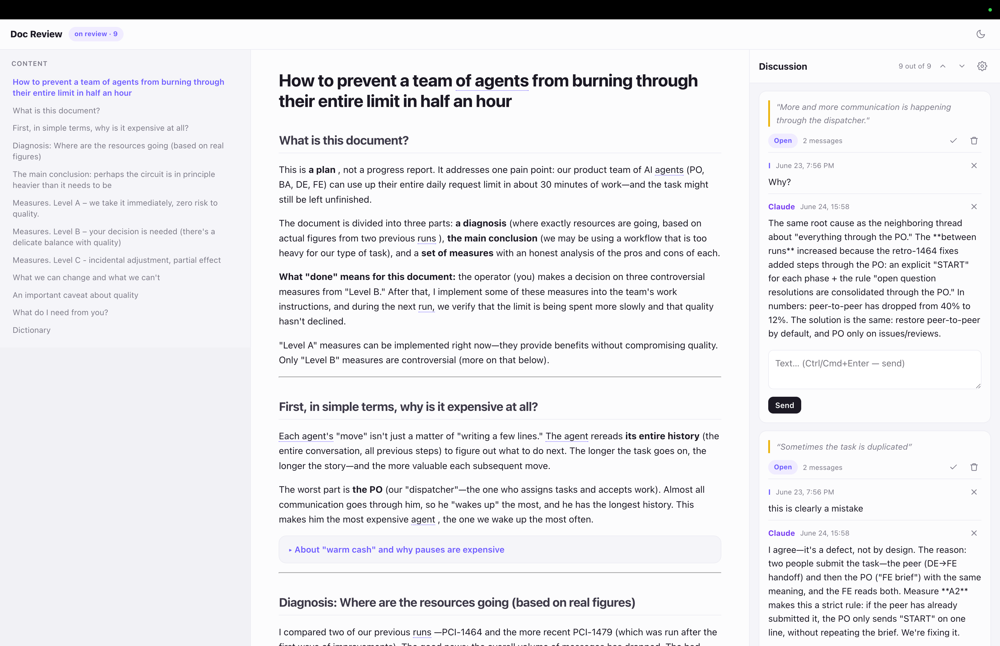

# claude-doc-review

A Claude Code plugin that turns any markdown document Claude wrote — a plan, a
spec, a design note — into a **human-friendly review page** you can actually
read and comment on, with your comments syncing straight back to Claude. No
cloud, no accounts, no telemetry: it's a single local HTML file and a tiny
local server, all on your machine.



## Why

When Claude writes a plan or spec, it writes it *for itself* — dense, full of
acronyms, TypeScript types, and decisions stated in shorthand. Reviewing that in
a chat scrollback is painful: you lose the place, your feedback isn't anchored to
anything, and the deep technical bits drown out the actual decisions.

`/doc-review` fixes that. It rewrites the document into plain prose, tucks the
deep detail under expandable blocks, explains every term, and lets you **select
any sentence and leave a comment** — which Claude reads and answers in place. The
document becomes a back-and-forth review surface instead of a wall of text.

## Features

- **Humanized rewrite** — Claude rephrases the terse source into clear prose,
  expanding jargon and acronyms on first use and leading with *what the thing is*
  and *what "done" means* before the mechanics.
- **Glossary tooltips** — a `## Словарь` / glossary section becomes hover-and-focus
  tooltips on every occurrence of each term (case-insensitive, inflection-aware),
  so readers never hit an unexplained word.
- **Collapsible detail** — genuinely deep asides (data models, edge cases) fold
  into `<details>` blocks, keeping the main read light; expand on demand.
- **Inline text-selection comments** — select any text on the page to drop a
  comment anchored to that exact quote (highlighted in the document). Each thread
  is an **ongoing back-and-forth**, not a one-shot: reply as many rounds as you
  need, with nested replies, and Claude answers every open thread that has a new
  message from you.
- **Two-way sync with Claude** — comments persist to a `comments.json` file that
  Claude reads and writes; the page polls and shows Claude's replies **live**, with
  no copy-paste between the doc and the chat. Claude answers every **open** thread;
  it does not touch resolved ones.
- **Resolve & reopen** — close a thread once the point is settled: Claude stops
  answering it and its comment box disappears. **Reopen** it (the ↺ button) to pick
  the discussion back up.
- **Navigation** — table of contents with scroll-spy, next/previous open-comment
  jumps, and click-to-locate (clicking a comment scrolls to its highlight — and
  opens a collapsed block if the quote lives inside one).
- **Status at a glance** — the header shows open / total comment counts and a
  draft → in-review → done pill.
- **Light & dark themes** — toggle in the header, remembered across sessions.
- **100% local & private** — no server in the cloud, no account, no telemetry.
  Output is plain files in your project, automatically kept out of its git.

## Install

Inside Claude Code, add this GitHub repo as a plugin source and install from it
— no central publishing involved. These are two separate slash commands; run
them one at a time, in order (the install needs the source added first):

```bash
/plugin marketplace add kalatsch/claude-doc-review
/plugin install claude-doc-review@claude-doc-review
```

To update later, use the built-in `/plugin` menu → **Manage plugins →
claude-doc-review → Update** (then restart the window or run `/reload-plugins`
to load it into the current session).

> Sharing with teammates? Send them the install page —
> **<https://kalatsch.github.io/claude-doc-review/>** (served from
> [`docs/index.html`](docs/index.html) via GitHub Pages).

## Usage

```
/doc-review path/to/document.md
```

Claude humanizes the file, lays the review page down next to it, starts a local
server, and opens it in your browser. Then:

1. **Read** the rewritten document; hover glossary terms, expand detail blocks.
2. **Select** any text and click the floating button to leave a comment. Keep the
   conversation going inside the thread — reply as many rounds as you need.
3. Ask Claude to **check the comments** — it answers every open thread that has a
   new message from you; the page updates live. Repeat as long as you want; the
   discussion isn't one-shot.
4. **Resolve** a thread when it's settled — Claude then leaves it alone. **Reopen**
   it later if you need to continue (resolved threads have no comment box until
   you do).

## How it works

```
your terse doc.md
      │  /doc-review
      ▼
Claude rewrites it ──► human.md   (plain prose + ## Словарь + <details>)
      │
      ▼
.claude/doc-review/<slug>/        review.html · serve.cjs · marked.min.js
                                  human.md · source.md · comments.json
      │  node serve.cjs  (free port, opens the browser)
      ▼
review.html  ── renders human.md, builds glossary + TOC, overlays comments
      │
   you select text → comment ──► POST ──► comments.json
                                            ▲   │ page polls (X-Version)
                          Claude reads/writes┘   ▼  shows replies live
```

1. `/doc-review <file.md>` — Claude reads the source and writes `human.md`:
   plain prose, a `## Словарь` glossary, and collapsible `<details>` for the
   deep parts.
2. The command copies `review.html`, `serve.cjs`, and `marked.min.js` into
   `<project>/.claude/doc-review/<slug>/`, writes `source.md` and an empty
   `comments.json`, and drops a self-contained `.gitignore` so none of it lands
   in the host project's git.
3. It starts `serve.cjs` (a dependency-free Node HTTP server — `.cjs` so it runs
   even in projects whose `package.json` declares `"type": "module"`) on a free
   port and opens the page.
4. `review.html` renders `human.md` client-side (via a vendored `marked`), builds
   the glossary tooltips and the table of contents, and overlays the commenting
   engine. Comments round-trip through `comments.json`: the page `POST`s yours
   and polls for changes; Claude reads the file and appends replies.

### Where things live

Everything for one document sits in `<project>/.claude/doc-review/<slug>/`:

| File | What it is |
|---|---|
| `human.md` | the humanized document the page renders |
| `source.md` | a copy of the original technical doc |
| `comments.json` | the comment threads (the Claude ↔ page channel) |
| `review.html` | the self-contained review page |
| `serve.cjs` | the tiny local static + comments-API server |
| `marked.min.js` | vendored markdown renderer |

## Development

```bash
npm install            # installs playwright (devDependency)
npx playwright install chromium
npm test               # serve API test + browser smoke + e2e
```

See `docs/specs/` for the design and `docs/plans/` for the implementation plan.

## License

MIT.
